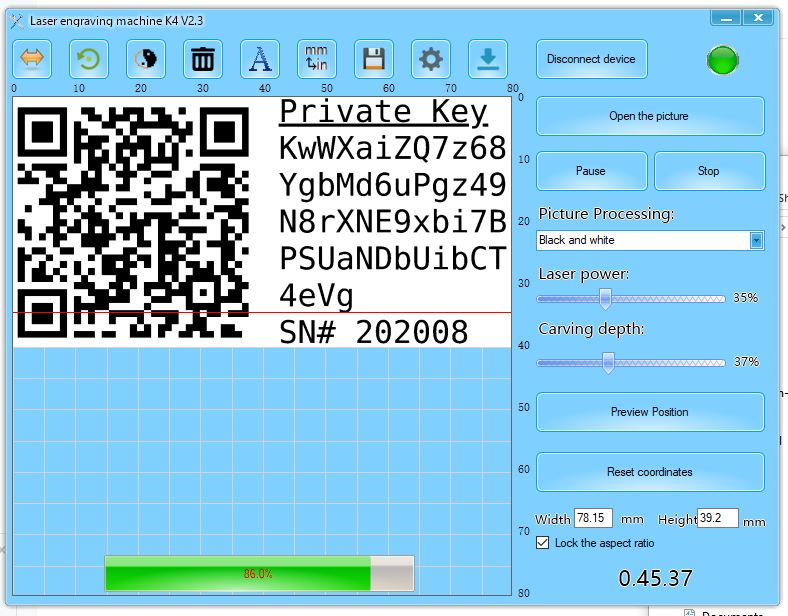
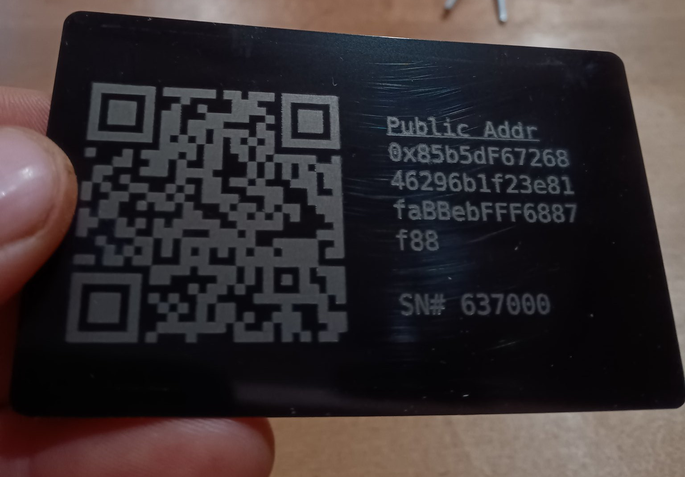

## Plastic Wallet Maker

This is a node.js JavaScript app that generates 'paper' wallets for Bitcoin Cash. These kinds of wallets are often called 'cold storage' wallets too. The artwork generated by this software is intended to etched on to material using a laser engraver. Documentation and videos can be found at [OpenSourceMetalWallet.com](https://OpenSourceMetalWallet.com).

YouTube videos about this code and related topics:

- [Mastering BCH: Keys, Addresses, and Mnemonic](https://youtu.be/OuFFLmOC7F0?si=YyHzH8EDU6NsqtOh) - Covers paper wallets
- [Laser Engraged Plastic BCH Wallet](https://youtu.be/3qn0mmfwlBQ)
- [How to Store SLP Tokens](https://youtu.be/g7G-TZ7fW2s)
- [Retrieving funds from a paper wallet (sweeping)](https://youtu.be/QW9xixHaEJE)

BCH and SLP tokens can be 'swept' to retrieve them from the paper wallet, by using [wallet.FullStack.cash](https://wallet.fullstack.cash).

The artwork is generated as an HTML page that can be captured as screen-shot
images. The images can be exported to the laser engraver and etched onto the
plastic cards.

## Installation

- Install [NodeJS](http://nodejs.org/) LTS version 20.x or greater.

- Clone this repository:

`git clone https://github.com/christroutner/plastic-wallet`

- Install the dependencies:

`cd plastic-wallet && npm install`

## Usage

This program has a series of npm scripts for generating paper wallets for different cryptocurrencies and different quantities.

- `npm start` - display the latest help menu.
- `npm run bch` - generate BCH paper wallets.
- `npm run slp` - generate SLP token paper wallets.
- `npm run xec` - generate eCash (XEC) paper wallets.
- `npm run btc` - generate Bitcoin (BTC) paper wallets.
- `npm run eth` - generate Ethereum (ETH) paper wallets. This also works for ETH-clone chains like AVAX.
- `npm run bch:bulk` - Generate a 3x5 grid of BCH wallets.
- `npm run btc:bulk` - Generate a 3x5 grid of BTC wallets.
- `npm run eth:bulk` - Generate a 3x5 grid of ETH wallets.

The above scripts for generating the paper wallets have variables at the very top, that you can customize. But they should also 'just work'. The HTML output is located in the `output/html` folder.

**Documentation and videos can be found at [OpenSourceMetalWallet.com](https://OpenSourceMetalWallet.com).**
